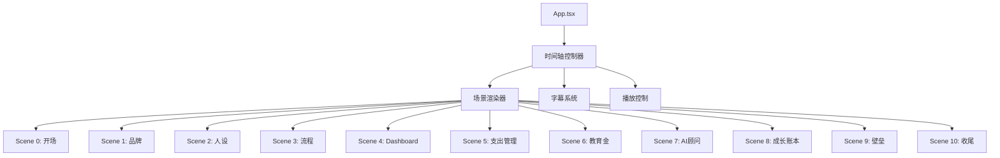

# 招贝产品演示视频页面 - 技术架构文档

## 1. 架构设计



## 2. 技术描述

- **前端**: React 18 + TypeScript + Vite
- **动画**: Framer Motion
- **状态管理**: React Context（时间轴状态）
- **样式**: Tailwind CSS + 自定义 CSS 变量
- **图标**: Lucide React

## 3. 项目结构

```
src/
  App.tsx                 # 主应用组件
  main.tsx               # 入口
  index.css              # 全局样式
  data/
    script.ts            # 旁白字幕数据
    timeline.ts          # 时间轴配置
  components/
    Stage.tsx            # 舞台容器
    PhoneMockup.tsx      # iPhone 样机
    ShellLogo.tsx        # 贝壳幼苗 Logo
    BillCard.tsx         # 账单卡片
    Dashboard.tsx        # Dashboard 页面
    ExpensePage.tsx      # 支出管理页面
    EducationPlanPage.tsx # 教育金规划页面
    AgentChat.tsx        # AI 顾问对话
    GrowthTimeline.tsx   # 成长时间轴
    NarrationCaption.tsx # 旁白字幕
    ProgressBar.tsx      # 视频进度条
    PlaybackControls.tsx # 播放控制
    FlowChart.tsx        # 流程图
    AgentProfile.tsx     # 智能体人设
    BarrierCards.tsx     # 能力壁垒卡片
    CountUp.tsx          # 数字动画
```

## 4. 时间轴驱动机制

- 全局 `time` 状态（0 - 180000ms）
- `requestAnimationFrame` 驱动时间推进
- 每个 Scene 根据当前时间计算显示状态和动画进度
- 使用 `useTimeline` hook 封装时间逻辑

## 5. 动画实现

- Framer Motion `motion` 组件
- `animate` 属性控制动画
- `transition` 配置缓动函数
- `useAnimation` 控制复杂序列
- `staggerChildren` 实现依次入场
